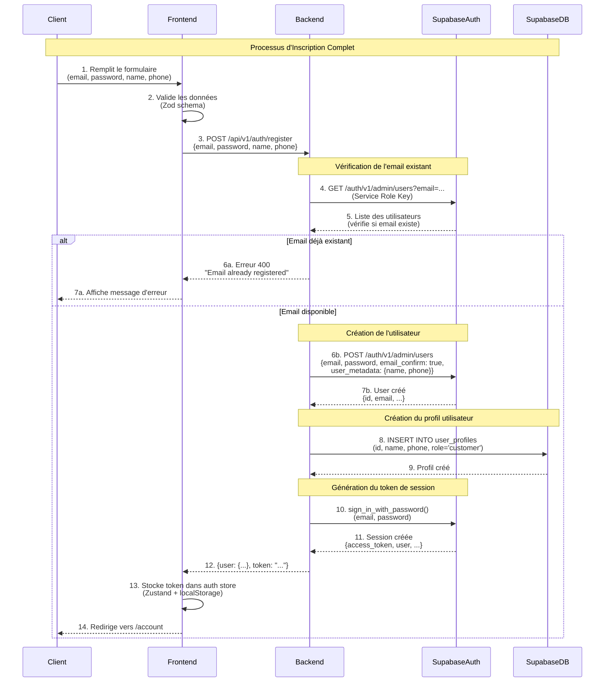
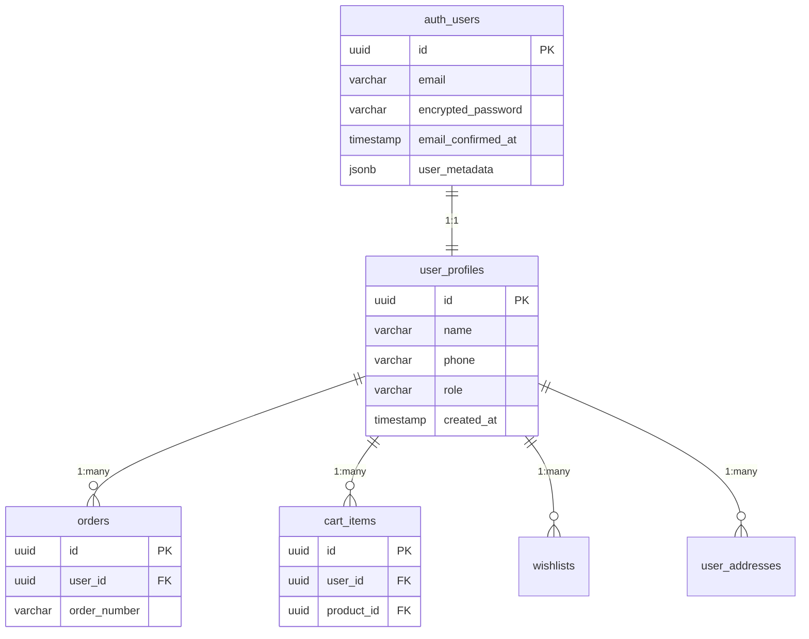
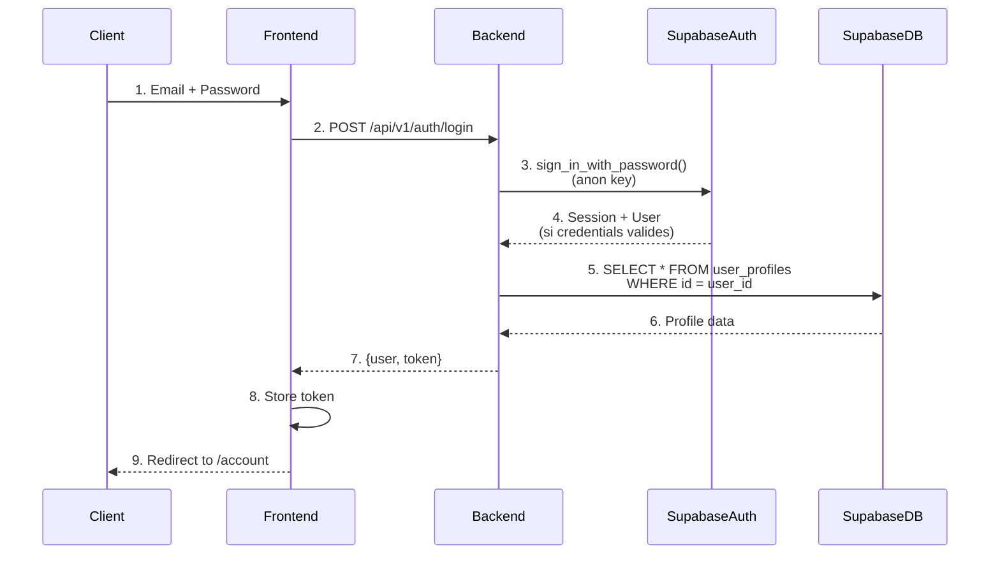

# Documentation du Flux d'Authentification

## Vue d'ensemble

Ce document explique comment fonctionne l'authentification dans l'application e-commerce, où les données des clients sont stockées, et comment le processus d'inscription et de connexion fonctionne entre le frontend, le backend et Supabase.

## Flux d'Inscription (Registration Flow)

### Diagramme de séquence



### Étapes détaillées du processus d'inscription

#### 1. **Soumission du formulaire (Frontend)**

L'utilisateur remplit le formulaire d'inscription avec :
- **Email** : Adresse email valide
- **Password** : Mot de passe (minimum 6 caractères)
- **Name** : Nom complet
- **Phone** : Numéro de téléphone (optionnel)

**Fichier** : `frontend/src/components/auth/RegisterForm.tsx`

```typescript
const onSubmit = async (data: RegisterFormData) => {
  const response = await authApi.register(
    data.email, 
    data.password, 
    data.name, 
    data.phone
  );
  login(response.user, response.token);
  router.push('/account');
};
```

#### 2. **Validation côté client**

Le frontend valide les données avec Zod :
- Email doit être valide
- Password minimum 6 caractères
- Confirmation du mot de passe doit correspondre

#### 3. **Requête au backend**

**Endpoint** : `POST /api/v1/auth/register`

**Fichier** : `backend/app/api/v1/routes/auth.py` (ligne 51)

Le backend reçoit :
```json
{
  "email": "user@example.com",
  "password": "securepassword",
  "name": "John Doe",
  "phone": "+1234567890"
}
```

#### 4. **Vérification de l'email existant**

Le backend utilise l'API Admin de Supabase pour vérifier si l'email existe déjà :

```python
# GET /auth/v1/admin/users?email=user@example.com
# Headers: Service Role Key
```

Si l'email existe → Retourne erreur 400 "Email already registered"

#### 5. **Création de l'utilisateur dans Supabase Auth**

Si l'email est disponible, le backend crée l'utilisateur via l'API Admin :

```python
POST /auth/v1/admin/users
{
  "email": "user@example.com",
  "password": "securepassword",
  "email_confirm": true,  # Auto-confirme l'email
  "user_metadata": {
    "name": "John Doe",
    "phone": "+1234567890"
  }
}
```

**Pourquoi utiliser l'API Admin ?**
- Permet de créer des utilisateurs avec `email_confirm: true` (bypass de la confirmation email)
- Nécessaire pour les emails de test (@example.com)
- Utilise la Service Role Key (clé secrète, backend uniquement)

**Résultat** : Un utilisateur est créé dans `auth.users` avec :
- `id` : UUID unique
- `email` : Adresse email
- `encrypted_password` : Mot de passe hashé (bcrypt)
- `email_confirmed_at` : Timestamp de confirmation
- `user_metadata` : JSON avec name et phone

#### 6. **Création du profil utilisateur**

Le backend crée ensuite un profil dans la table `user_profiles` :

```python
INSERT INTO public.user_profiles (id, name, phone, role)
VALUES (user_id, 'John Doe', '+1234567890', 'customer')
```

**Table** : `public.user_profiles`
- `id` : UUID (clé étrangère vers `auth.users.id`)
- `name` : Nom complet
- `phone` : Téléphone (optionnel)
- `role` : 'customer' ou 'admin'
- `created_at` : Timestamp
- `updated_at` : Timestamp

#### 7. **Génération du token de session**

Pour obtenir un token valide, le backend se connecte avec les identifiants :

```python
supabase_anon.auth.sign_in_with_password({
    "email": "user@example.com",
    "password": "securepassword"
})
```

**Résultat** : Une session Supabase avec :
- `access_token` : JWT token valide
- `user` : Objet utilisateur
- `session` : Informations de session

#### 8. **Retour au frontend**

Le backend retourne :
```json
{
  "user": {
    "id": "uuid",
    "email": "user@example.com",
    "name": "John Doe",
    "phone": "+1234567890",
    "role": "customer"
  },
  "token": "eyJhbGciOiJIUzI1NiIsInR5cCI6IkpXVCJ9..."
}
```

#### 9. **Stockage du token (Frontend)**

Le frontend stocke le token dans :
- **Zustand Store** : `authStore` (mémoire)
- **localStorage** : Persistance via Zustand persist middleware

**Fichier** : `frontend/src/lib/store/authStore.ts`

```typescript
login: (user, token) => {
  set({ user, token, isAuthenticated: true });
}
```

#### 10. **Redirection**

L'utilisateur est redirigé vers `/account` où il peut voir ses informations.

## Où sont stockées les données ?

### 1. **Données d'authentification** (`auth.users`)

**Schéma** : `auth` (géré par Supabase Auth)
**Table** : `auth.users`

| Colonne | Type | Description |
|---------|------|-------------|
| `id` | UUID | Identifiant unique de l'utilisateur |
| `email` | VARCHAR | Adresse email |
| `encrypted_password` | VARCHAR | Mot de passe hashé (bcrypt) |
| `email_confirmed_at` | TIMESTAMP | Date de confirmation email |
| `user_metadata` | JSONB | Métadonnées utilisateur (name, phone) |
| `app_metadata` | JSONB | Métadonnées application |
| `created_at` | TIMESTAMP | Date de création |

**Accès** :
- ❌ **Pas accessible directement** via SQL (sécurité Supabase)
- ✅ **Via Admin API** avec Service Role Key
- ✅ **Via Auth API** pour les opérations utilisateur

**Exemple de requête** (Admin API uniquement) :
```sql
-- Cette requête ne fonctionne PAS directement
-- Il faut utiliser l'API Admin de Supabase
SELECT id, email, email_confirmed_at 
FROM auth.users 
WHERE email = 'demo@example.com';
```

### 2. **Profil utilisateur** (`public.user_profiles`)

**Schéma** : `public`
**Table** : `user_profiles`

| Colonne | Type | Description |
|---------|------|-------------|
| `id` | UUID | Clé étrangère vers `auth.users.id` |
| `name` | VARCHAR | Nom complet |
| `phone` | VARCHAR | Numéro de téléphone (nullable) |
| `role` | VARCHAR | Rôle ('customer' ou 'admin') |
| `created_at` | TIMESTAMP | Date de création |
| `updated_at` | TIMESTAMP | Dernière mise à jour |

**Accès** :
- ✅ **Via Supabase Client** (PostgREST)
- ✅ **Via SQL direct** (avec permissions appropriées)
- ✅ **Protégé par RLS** (Row Level Security)

**Exemple de requête** :
```sql
SELECT id, name, phone, role, created_at
FROM public.user_profiles
WHERE id = '3d86dcf8-cada-4715-8989-eb1858f5d5f6';
```

### 3. **Token de session (JWT)**

**Stockage** :
- **Frontend** : Zustand store + localStorage
- **Backend** : Aucun stockage (stateless)

**Structure du token** :
```json
{
  "aud": "authenticated",
  "exp": 1735819200,
  "iat": 1735815600,
  "sub": "user-uuid",
  "email": "user@example.com",
  "role": "authenticated",
  "user_metadata": {
    "name": "John Doe",
    "phone": "+1234567890"
  }
}
```

**En-tête du token** (JWT Header) :
```json
{
  "alg": "ES256",
  "typ": "JWT",
  "kid": "1E898BE4-0D69-4F33-AB8A-145F12AABA20"
}
```

**Utilisation** :
- Envoyé dans le header : `Authorization: Bearer <token>`
- Vérifié par le backend à chaque requête authentifiée avec les clés publiques ECC P-256
- Expire après 1 heure (configurable)
- Signé avec l'algorithme ES256 (ECC P-256)
- Le `kid` (Key ID) dans l'en-tête identifie la clé utilisée pour la signature

## Relations entre les tables



## Flux de connexion (Login Flow)

### Diagramme simplifié



### Différences avec l'inscription

1. **Pas de création** : L'utilisateur existe déjà
2. **Vérification du mot de passe** : Supabase vérifie le hash
3. **Pas besoin d'Admin API** : Utilise l'anon key (client public)
4. **Création automatique du profil** : Si le profil n'existe pas, il est créé

## Sécurité

### 1. **Stockage des mots de passe**

- ❌ **Jamais en plain text**
- ✅ **Hashé avec bcrypt** par Supabase
- ✅ **Stocké dans `auth.users.encrypted_password`**
- ✅ **Impossible de récupérer le mot de passe original**

### 2. **Tokens JWT**

- ✅ **Signés** avec des clés ECC P-256 (ES256) via Supabase JWT Signing Keys
- ✅ **Expiration** après 1 heure (configurable)
- ✅ **Vérification** de la signature à chaque requête avec les clés publiques
- ✅ **Contient** uniquement des informations non sensibles
- ✅ **Rotation automatique** des clés supportée (current, standby, previously used)
- ✅ **Clés récupérées** depuis l'endpoint JWKS de Supabase

**Note**: Le système utilise maintenant les nouvelles JWT Signing Keys (ECC P-256) au lieu de l'ancien secret partagé (HS256). Les tokens sont signés avec l'algorithme ES256 et vérifiés avec les clés publiques récupérées depuis `{SUPABASE_URL}/auth/v1/.well-known/jwks.json`.

### 3. **Clés API**

- **Anon Key** : Publique, utilisée pour l'authentification utilisateur
- **Service Role Key** : Secrète, utilisée uniquement backend pour opérations admin
- **JWT Signing Keys** : Clés publiques ECC P-256 récupérées depuis JWKS endpoint (remplace l'ancien JWT Secret)

### 4. **Row Level Security (RLS)**

Toutes les tables ont RLS activé :
- Les utilisateurs ne peuvent accéder qu'à leurs propres données
- Le backend utilise Service Role Key (bypass RLS)
- Protection contre l'accès non autorisé

## Exemple de données après inscription

### Dans `auth.users` :
```json
{
  "id": "3d86dcf8-cada-4715-8989-eb1858f5d5f6",
  "email": "demo@example.com",
  "encrypted_password": "$2a$10$...",
  "email_confirmed_at": "2025-12-10T00:46:20.447082Z",
  "user_metadata": {
    "name": "Demo User",
    "phone": null
  },
  "created_at": "2025-12-10T00:46:20.447082Z"
}
```

### Dans `public.user_profiles` :
```json
{
  "id": "3d86dcf8-cada-4715-8989-eb1858f5d5f6",
  "name": "Demo User",
  "phone": null,
  "role": "customer",
  "created_at": "2025-12-10T00:46:21.960950Z",
  "updated_at": "2025-12-10T00:46:21.960950Z"
}
```

## Dépannage

### Problème : Email déjà enregistré
**Solution** : L'utilisateur doit se connecter au lieu de s'inscrire

### Problème : Profil non créé
**Solution** : Le profil est créé automatiquement lors de la première connexion

### Problème : Token invalide
**Vérifier** :
1. Token n'est pas expiré (`exp` claim)
2. Token utilise l'algorithme ES256 (ECC P-256)
3. Token est bien formaté (Bearer token)
4. Les clés JWT sont accessibles depuis l'endpoint JWKS de Supabase
5. Le cache des clés n'est pas expiré (rafraîchissement automatique toutes les heures)

**Note**: Le système utilise maintenant les JWT Signing Keys (ES256) au lieu de l'ancien secret partagé. Les tokens signés avec HS256 ne sont plus acceptés.

### Problème : Mot de passe incorrect
**Solution** : Utiliser l'endpoint `/api/v1/auth/reset-demo-password` pour réinitialiser

## Fichiers clés

### Backend
- `backend/app/api/v1/routes/auth.py` : Endpoints d'authentification
- `backend/app/api/deps.py` : Vérification des tokens
- `backend/app/database.py` : Clients Supabase

### Frontend
- `frontend/src/lib/api/auth.ts` : API client pour l'authentification
- `frontend/src/lib/store/authStore.ts` : Store Zustand pour l'état auth
- `frontend/src/components/auth/RegisterForm.tsx` : Formulaire d'inscription
- `frontend/src/components/auth/LoginForm.tsx` : Formulaire de connexion

## Résumé

1. **Inscription** : Crée utilisateur dans `auth.users` + profil dans `user_profiles` + retourne token
2. **Connexion** : Vérifie credentials + retourne token
3. **Données stockées** : 
   - Auth data → `auth.users` (Supabase Auth)
   - Profile data → `public.user_profiles` (Database)
   - Token → Frontend (localStorage)
4. **Sécurité** : 
   - Mots de passe hashés
   - Tokens signés avec ECC P-256 (ES256) via JWT Signing Keys
   - Clés publiques récupérées depuis JWKS endpoint
   - Rotation automatique des clés supportée
   - RLS activé

